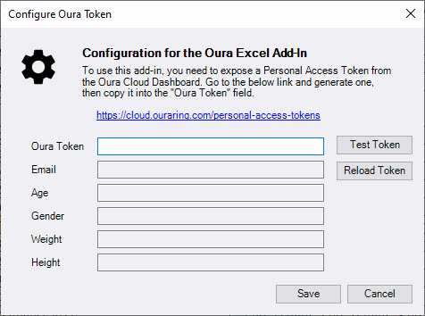

# ExcelOuraVSTOAddIn
An Excel VSTO Add-In that will retrieve your Oura ring data from the Oura Cloud into your Excel document. 
Obviously you require "Excel" to be installed on your computer for this to be used. 
Written in C# using Visual Studio Community 2019 edition. 
To use this you will have to go into your Oura Dashboard (https://cloud.ouraring.com/dashboard) and 
select "Oura Developer" (https://cloud.ouraring.com/personal-access-tokens) from there, under "Personal 
Access Tokens", "Create New Personal Access Token" to use for this. Copy that token, and you will have to 
enter it in the app.Config in the appropriate place. Once this is in place, you should be able to run and 
execute the extension.  
If you would prefer to use OAuth2 Authentication, feel free to implement this, but please ensure by default
this add-in is left configured for Personal Access Token use.

This add-In will allow you to select which fields of information you want to download and in what order, for 
what time frame (by default a week, but you can go for years), and if you want headers to be included or not. 

NOTE 2: Just in case you need it, it appears the "live" configuration file for the add-in is located under
C:\Users\<profile name>\AppData\Local\Microsoft_Corporation
in a folder with the name starting "ExcelOuraVSTOAddIn"

The latest installable version is available under the "_Releases" folder and here - https://github.com/tgreve15/ExcelOuraVSTOAddIn/blob/master/_Releases/ExcelOuraVSTOAddIn_1_0_0_10.zip
Either right click here and choose "Save As" to your computer, or choose "Download" from bottom right when you click on the link. Once downloaded, open the file and run the "setup.exe" file to install the add-in.

## Excel Command Bar

## Configuration Form
Select the date range, fields and other information to include in Excel from your Oura dashboard. This is only available once your Oura Personal Access Token is configured below.

## Configure Oura Token
To access your Oura data, you need to create a "Personal Access Token" within the Oura Dashboard and enter that on this form in the Add-In. This is only stored locally and used each time a request is made to get data. "Test Token" will return your profile information configured in Oura. 

